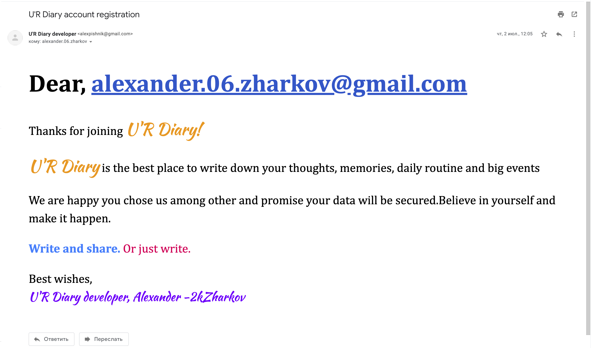

# Online diary - U'R Diary📓

## Table of Contents
- [Description](#description)
- [Preview](#preview)
- [How To Use](#how-to-use)
- [Author info](#author-info)

## Description
I developed this project for my academic internship at college which is part of the education process
at the end of the second year. So I decided to create something that is cool modern and can bring real use to people.
It is an online diary. My creativity told me to name it U'R Diary.

### What this app can do? 💪
- You can register and login into your personal room
- After registration app sends an email
- User personal room consists of his notes and profile info
- You can add, delete, edit notes and decorate them with images
- Also text of every note can be formatted, i.e. font size, font-weight, and some basic structures like
  lists, headers, and paragraphs
- Search through notes is included
- Every note can be exported in its personal .pdf file. Or just in one file as the user decides. Those notes will
  never be lost
- You can reach other users, send them invitation notifications. And if the user decide so, you can
  watch his notes and leave comments which, by the way, can be removed by an owner of the diary

### What do I like about this project?🤩
- The first idea for implementation was to make a diary like some ToDo list app, but I'm glad it got more complex
  and interesting
- I've never made frontend works for emails, and it was challenging
- It was my first React project, and I learned a lot about working with React during the development process
- I was trying to follow best practices of React like state, props, single responsibility of the components
- App has a server developed with Node.js. There is also a MySql database to store user's data. I'm glad I was
  able to make a full-stack application using only javascript as programing language
- I discovered that I can learn really fast especially when there is a reason for it

### What don't like about this project?🧐
- There is a MySql database which isn't the best practice. And I felt it when was working with the database and server. Only later I found out about MongoDB
- State management has got pretty complex by the end of the project because I used local state and there were
  no time for learning Redux
- The design is not an adaptive
- The design wasn't thought through well, because there was an upcoming deadline

## Preview
|                      Landing page|      and it's continue                 | 
| :-----------------------------------: | :-----------------------------------: |
|  | |
|  | |
|                      Loging page|      Registration page                | 
|  | |
Notification email

|                      User's personal room|      Creating first note                 | 
| :-----------------------------------: | :-----------------------------------: |
|  | |
|                      Personal room with new note|      Changing profile image               | 
|  | |
|                      Updated profile image|      Friends section              | 
|  | |
|                      Match for user's name|      Invitation for friendship was sent              | 
|  | |
|                      Some user's notifications section|     Friendship invitation was accepted              | 
|  | |
|                      Friends section if user had friends|    Some user's room if two users were friends               | 
|  | |
|                      Writing comment|     Friend's comments               | 
|  | |
Comment section when there are no comments

## How To Use
Node.js must be installed on your PC.
Then clone this project and run the command 'npm install' in its directory, because you need node modules.
Run 'npm start' also in the project directory.
You are good to go

## Author info

Write to me at alexander.06.zharkov@gmail.com if you have any thoughts about this project or something like an internship/job offer